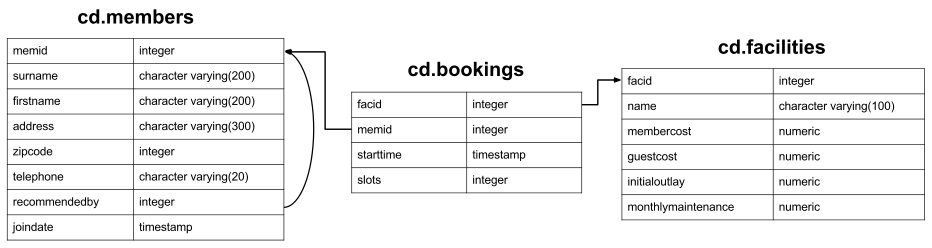

# ___Домашняя работа №2: Агрегации, группировки, соединения, подзапросы___

## ___Контекст задачи 1___

В схеме `public` имеется таблица с историей криптовалюты.

```postgresql
CREATE TABLE IF NOT EXISTS coins(
    dt VARCHAR(16),
    avg_price NUMERIC,
    tx_cnt NUMERIC,
    tx_vol NUMERIC,
    active_addr_cnt NUMERIC,
    symbol VARCHAR(8),
    full_nm VARCHAR(128),
    open_price NUMERIC,
    high_price NUMERIC,
    low_price NUMERIC,
    close_price NUMERIC,
    vol NUMERIC,
    market NUMERIC
)
```

Поясним значения хранящиеся в колонках:

* `dt` — дата измерений
* `avg_price` — средняя цена монеты за торговый день в USD
* `tx_cnt` — количество транзакций в сети данной монеты
* `tx_vol` — объем монет переведенных между адресами в сети данной монеты
* `active_addr_cnt` — количество адресов совершавших а данный день транзации в сети данной монеты
* `symbol` — сокращенное название монеты
* `full_nm` — полное название монеты
* `open_price` — цена монеты в начале торгов данного дня
* `high_price` — самая высокая цена данной монеты в течение данного торгового дня
* `low_price` — самая низкая цена данной монеты в течение данного торгового дня
* `close_price` — цена монеты в конце торгов данного дня
* `vol` — объем торгов данной монетой на биржах в данный день
* `market` — капитализация данной монеты в данный день

---

## ___Контекст задач 2-10___

Имеется база данных для недавно созданного загородного клуба. В ней имеется информация о членах этого клуба, объектов для 
отдыха, таких как теннисные корты, и истории бронирования. Помимо прочего, клуб хочет понять, как они могут использовать 
свою информацию для анализа использования/спроса на объекты. __Обратите внимание__: этот набор данных предназначен 
исключительно для интересного набора упражнений, а схема базы данных несовершенна в нескольких аспектах — пожалуйста, не
воспринимайте ее как пример хорошего дизайна.

В БД в схеме `cd` имееются 3 таблицы.  

**Таблица `cd.members`**

```postgresql
CREATE TABLE cd.members(
    memid          INTEGER                NOT NULL,
    surname        CHARACTER VARYING(200) NOT NULL,
    firstname      CHARACTER VARYING(200) NOT NULL,
    address        CHARACTER VARYING(300) NOT NULL,
    zipcode        INTEGER                NOT NULL,
    telephone      CHARACTER VARYING(20)  NOT NULL,
    recommendedby  INTEGER,
    joindate       TIMESTAMP              NOT NULL,
    
    CONSTRAINT members_pk PRIMARY KEY (memid),
    
    CONSTRAINT fk_members_recommendedby FOREIGN KEY (recommendedby)
        REFERENCES cd.members(memid) ON DELETE SET NULL
);
```

У каждого участника есть идентификатор (не обязательно последовательный), основная информация об адресе, ссылка на 
участника, который рекомендовал их (если есть), и отметка времени, когда они присоединились.

**Таблица `cd.facilities`**

```postgresql
CREATE TABLE cd.facilities(
   facid               INTEGER                NOT NULL, 
   name                CHARACTER VARYING(100) NOT NULL, 
   membercost          NUMERIC                NOT NULL, 
   guestcost           NUMERIC                NOT NULL, 
   initialoutlay       NUMERIC                NOT NULL, 
   monthlymaintenance  NUMERIC                NOT NULL, 
   
   CONSTRAINT facilities_pk PRIMARY KEY (facid)
);
```

В таблице перечислены все доступные для бронирования объекты, которыми располагает загородный клуб. Клуб хранит 
информацию об идентификаторе/имени, стоимости бронирования как членов, так и гостей, первоначальную стоимость строительства объекта и предполагаемые ежемесячные расходы на содержание.

**Таблица `cd.bookings`**

```postgresql
CREATE TABLE cd.bookings(
   bookid     INTEGER   NOT NULL, 
   facid      INTEGER   NOT NULL, 
   memid      INTEGER   NOT NULL, 
   starttime  TIMESTAMP NOT NULL,
   slots      INTEGER   NOT NULL,
   
   CONSTRAINT bookings_pk PRIMARY KEY (bookid),
   
   CONSTRAINT fk_bookings_facid FOREIGN KEY (facid) REFERENCES cd.facilities(facid),
   
   CONSTRAINT fk_bookings_memid FOREIGN KEY (memid) REFERENCES cd.members(memid)
);
```

И таблица, отслеживающая бронирование объектов. В нем хранится идентификатор объекта, член, который сделал бронирование,
начало бронирования и количество получасовых «слотов», на которые было сделано бронирование.

Схематически это выглядит примерно так:


---

## ___Task 01___

Найти среднюю, максимальную и минимальную цены по каждой монете.

### Ожидаемый формат ответа

Ваш запрос должен возвращать таблицу формата:

<div align="center">

| full_name | avg_price | max_price | min_price |
|-----------|-----------|-----------|-----------|
| Bitcoin   | 21352.232 | 60000.0   | 12035.989 |

</div>

---

## ___Task 02___

Подсчитайте количество рекомендаций, сделанных каждым участником. Упорядочить по идентификатору участника.

### Ожидаемый формат ответа

Ваш запрос должен возвращать таблицу формата:

<div align="center">

| recommendedby | count |
|---------------|-------|
| 1             | 5     |
| 2             | 3     |
| 3             | 1     |
| ...           | ...   |

</div>

---

## ___Task 03___

Создайте список общего количества слотов, забронированных на объект в месяц в 2012 году. Создайте выходную таблицу, состоящую из идентификатора объекта и слотов, отсортированных по идентификатору и месяцу.

### Ожидаемый формат ответа

Ваш запрос должен возвращать таблицу формата:

<div align="center">

| facid | month | total_slots |
|-------|-------|-------------|
| 0     | 7     | 270         | 
| 0     | 8     | 459         | 
| ...   | ...   | ...         | 

</div>

---

## ___Task 04___

Составьте список общего количества слотов, забронированных по каждому объекту в месяц в 2012 году. 
В эту версию включите выходные строки, содержащие итоги за все месяцы по объекту и итоги за все месяцы по всем объектам.
Выходная таблица должна состоять из идентификатора объекта, месяца и слотов, отсортированных по идентификатору и месяцу. 
При вычислении агрегированных значений для всех месяцев и всех `facid` возвращайте нулевые значения в столбцах `month` и 
`facid`.

### Ожидаемый формат ответа

Ваш запрос должен возвращать таблицу формата:

<div align="center">

| facid | month | slots |
|-------|-------|-------|
| 0     | 7     | 270   | 
| 0     | 8     | 459   | 
| 0     | NULL  | 729   | 
| 1     | 10    | 100   | 
| 1     | 12    | 300   | 
| 1     | NULL  | 400   | 
| ...   | ...   | ...   | 
| NULL  | NULL  | 10000 |

</div>

---

## ___Task 05___

Верните таблицу имен и идентификаторов каждого участника и их первого бронирования после 1 сентября 2012 года. 
Упорядочьте по идентификатору участника.

### Ожидаемый формат ответа

Ваш запрос должен возвращать таблицу формата:

<div align="center">

| surname  | firstname  | memid | starttime           |
|----------|------------|-------|---------------------|
| GUEST    | GUEST      | 0     | 2012-09-01 08:00:00 |
| ...      | ...        | ...   |                     |

</div>

---

## ___Task 06___

Как вывести список всех участников, которые порекомендовали другого участника? Убедитесь, что в списке нет дубликатов и 
что результаты упорядочены по (фамилии, имени).

### Ожидаемый формат ответа

Ваш запрос должен возвращать таблицу формата:

<div align="center">

| firstname | surname    |
|-----------|------------|
| GUEST     | GUEST      |
| ...       | ...        |

</div>

---

## ___Task 07___

Как вывести список всех участников, включая тех, кто их порекомендовал (если есть)? Убедитесь, что результаты 
упорядочены по (фамилии, имени).

### Ожидаемый формат ответа

Ваш запрос должен возвращать таблицу формата:

<div align="center">

| memfname | memsname | recfname | recsname |
|----------|----------|----------|----------|
| GUEST    | GUEST    | NULL     | NULL     |
| GUEST1   | GUEST1   | GUEST    |  GUEST   |
| ...      | ...      |          |          |

</div>

---

## ___Task 08___

Как составить список всех участников, которые пользовались теннисным кортом? Включите в свой вывод название суда и имя члена, отформатированное как один столбец. Убедитесь, что данные не повторяются, и упорядочьте имя участника, за которым следует название объекта.

### Ожидаемый формат ответа

Ваш запрос должен возвращать таблицу формата:

<div align="center">

| member        | facility       |
|---------------|----------------|
| Anne Baker    | Tennis Court 1 |
| Anne Baker    | Tennis Court 2 |
| Burton Tracy  | Tennis Court 1 |
| ...           | ...            |

</div>

---

## ___Task 09___

Как вы можете составить список бронирований на `2012-09-14`, которые обойдутся участнику (или гостю) более чем в 30 
долларов? Помните, что гости имеют разные затраты по сравнению с участниками (перечисленные расходы указаны за 
получасовой «слот»), а гостевой пользователь всегда имеет идентификатор 0. Включите в свой вывод название объекта, 
имя члена, отформатированное как одно колонка и стоимость. Упорядочить по убыванию стоимости, в случае равенства 
отсортировать по `member` и `facility` лексикографически. 
**Решение не должно содержать ни одного соединения (`[INNER/LEFT OUTER/RIGHT OUTER/FULL] JOIN`, декартово соединение также).**

### Ожидаемый формат ответа

Ваш запрос должен возвращать таблицу формата:

<div align="center">

| member      | facility       | cost |
|-------------|----------------|------|
| Anne Baker  | Tennis Court 1 | 300  |
| Anne Baker  | Tennis Court 2 | 210  |
| GUEST GUEST | Tennis Court 1 | 120  | 
| ...         | ...            |      |

</div>

---

## ___Task 10___

Как вывести список всех участников, включая тех, кто их порекомендовал (если таковые имеются), без использования каких-либо объединений? Убедитесь, что каждая пара имя + фамилия отформатирована как столбец и упорядочена.
**Решение не должно содержать ни одного соединения (`[INNER/LEFT OUTER/RIGHT OUTER/FULL] JOIN`, декартово соединение также).**

### Ожидаемый формат ответа

Ваш запрос должен возвращать таблицу формата:

<div align="center">

| member         | recommender  |
|----------------|--------------|
| Anna Mackenzie | Burton Tracy |
| Burton Tracy   | NULL         |
| ...            | ...          |

</div>

---