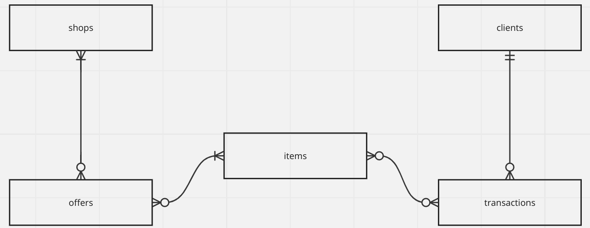
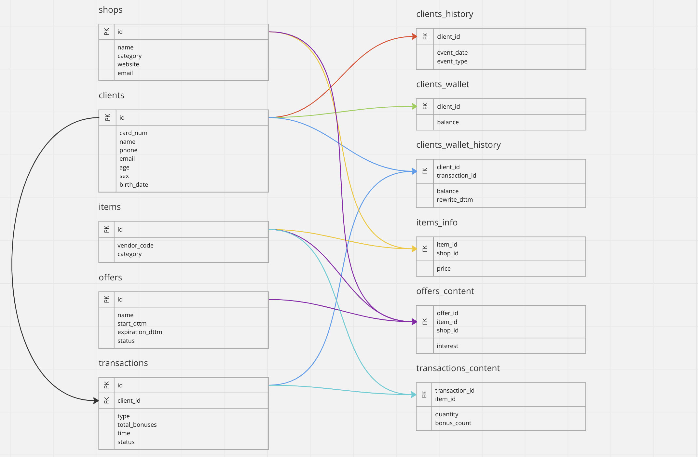

# База данных бонусной программы

## Концептуальная модель

    

### ___Основные сущности:___

- `shops` -- магазины, участвующие в программе и способные выдвигать предложения.
- `clients` -- клиенты, участвующие в бонусной программе.
- `offers` -- предложения, выдвигаемые магазинами.
- `items` -- продаваемые товары, участвующие в предложениях.
- `transactions` -- транзакции, производимые с бонусами.

## Логическая модель

    

### ___Добавленные зависимые таблицы:___

- `clients_history`
- `clients_wallet`
- `clients_wallet_history`
- `items_info`
- `offers_content`
- `transactions_content`

## Физическая модель

### ___Таблица `shops`___

Таблица `shops` предоставляет информацию о магазинах, участвующих в акционных предложениях, формируемых в данном торговом центре.

|   shops  |                            |              |                  |
|:--------:|:--------------------------:|:------------:|:----------------:|
|  Атрибут |          Описание          |      Тип     |    Ограничения   |
| id       | Идентификатор магазина     | SERIAL       | PRIMARY KEY      |
| name     | Название магазина          | VARCHAR(128) | UNIQUE, NOT NULL |
| category | Категория магазина         | VARCHAR(128) | NOT NULL         |
| website  | Сайт магазина              | VARCHAR(128) | NOT NULL         |
| email    | Электронный адрес магазина | VARCHAR(128) | UNIQUE, NOT NULL |

### ___Таблица `clients`___

Таблица `clients` предоставляет информацию о клиентах, участвующих в бонусной программе торгового центра.

|   clients  |                                   |              |                  |
|:----------:|:---------------------------------:|:------------:|:----------------:|
|   Атрибут  |              Описание             |      Тип     |    Ограничения   |
| id         | Идентификатор клиента в программе | SERIAL       | PRIMARY KEY      |
| card_num   | Номер бонусной карты клиента      | VARCHAR(32)  | UNIQUE, NOT NULL |
| name       | ФИО клиента                       | VARCHAR(256) | NOT NULL         |
| phone      | Номер телефона клиента            | VARCHAR(32)  | UNIQUE, NOT NULL |
| email      | Электронный адрес клиента         | VARCHAR(256) | -                |
| age        | Возраст клиента                   | INTEGER      | NOT NULL         |
| sex        | Пол клиента                       | VARCHAR(32)  | NOT NULL         |
| birth_date | Дата рождения                     | DATE         | NOT NULL         |

### ___Таблица `items`___

Таблица `items` предоставляет информацию о товарах, участвующих в бонусной программе торгового центра.

|    items    |                      |              |                  |
|:-----------:|:--------------------:|:------------:|:----------------:|
|   Атрибут   |       Описание       |      Тип     |    Ограничения   |
| id          | Идентификатор товара | SERIAL       | PRIMARY KEY      |
| vendor_code | Артикул товара       | VARCHAR(256) | UNIQUE, NOT NULL |
| category    | Категория товара     | VARCHAR(256) | NOT NULL         |

При этом таблица не содержит информации о цене конкретного товара, так как она не обязана совпадать в разных магазинах. Информация об актуальной цене товара хранится в таблице `items_info`.

### ___Таблица `offers`___

Таблица `offers` предоставляет информацию о предложениях бонусной программы торгового центра.

|      offers     |                               |              |             |
|:---------------:|:-----------------------------:|:------------:|:-----------:|
|     Атрибут     |            Описание           |      Тип     | Ограничения |
| id              | Номер предложения             | SERIAL       | PRIMARY KEY |
| name            | Название предложения          | VARCHAR(256) | NOT NULL    |
| start_dttm      | Дата начала предложения       | TIMESTAMP    | NOT NULL    |
| expiration_dttm | Дата истечения предложения    | TIMESTAMP    | NOT NULL    |
| status          | Статус активности предложения | BOOLEAN      | NOT NULL    |

### ___Таблица `transactions`___

Таблица `transactions` предоставляет информацию об операциях изменения балансов клиентов.

|  transactions |                             |                              |                          |
|:-------------:|:---------------------------:|:----------------------------:|:------------------------:|
|    Атрибут    |           Описание          |              Тип             |        Ограничения       |
| id            | Идентификатор транзакции    | SERIAL                       | PRIMARY KEY              |
| client_id     | Идентификатор клиента       | INTEGER                      | FOREIGN KEY (clients.id) |
| type          | Тип производимой транзакции | ENUM (purchase, gift, spend) | NOT NULL                 |
| total_bonuses | Количество бонусов          | FLOAT                        | NOT NULL                 |
| time          | Время совершения транзакции | TIMESTAMP                    | NOT NULL                 |
| status        | Статус транзакции           | ENUM (successful, aborted)   | NOT NULL                 |

Введен перечислимый тип для поля `type`, всего сочтены необходимыми состояния `purchase` для начисления за покупку, `gift` для подарков и `spend` для списаний бонусов.

Введен перечислимый тип для поля `status`, всего сочтены необходимыми состояния `successful` для успешного проведения транзакции и `aborted` на случай отмены покупок.

### ___Таблица `clients_history`___

Таблица `clients_history` предоставляет информацию об истории взаимодействия клиента с бонусной системой.

| clients_history |                       |                                   |                          |
|:---------------:|:---------------------:|:---------------------------------:|:------------------------:|
|     Атрибут     |        Описание       |                Тип                |        Ограничения       |
| client_id       | Идентификатор клиента | INTEGER                           | FOREIGN KEY (clients.id) |
| event_dttm      | Дата события          | TIMESTAMP                         | NOT NULL                 |
| event_type      | Тип события           | ENUM (join, pause, resume, leave) | NOT NULL                 |

Введен перечислимый тип для поля `event_type`, всего сочтены необходимыми состояния `join` для первичной регистрации, `pause` для приостановки членства, `resume` для продолжения членства, `leave` для окончательного выхода из программы.

### ___Таблица `clients_wallet`___

Таблица `client_wallet` предоставляет информацию об актуальном балансе клиента.

| clients_wallet |                        |         |                          |
|:--------------:|:----------------------:|:-------:|:------------------------:|
|     Атрибут    |        Описание        |   Тип   |        Ограничения       |
| client_id      | Идентификатор клиента  | INTEGER | FOREIGN KEY (clients.id) |
| balance        | Текущий баланс клиента | FLOAT   | DEFAULT 0, NOT NULL      |

### ___Таблица `clients_wallet_history`___

Таблица `client_wallet_history` предоставляет информацию об истории изменения баланса клиента.

| clients_wallet_history |                            |           |                               |
|:----------------------:|:--------------------------:|:---------:|:-----------------------------:|
|         Атрибут        |          Описание          |    Тип    |          Ограничения          |
| client_id              | Идентификатор клиента      | INTEGER   | FOREIGN KEY (clients.id)      |
| transaction_id         | Идентификатор транзакции   | INTEGER   | FOREIGN KEY (transactions.id) |
| balance                | Текущий баланс клиента     | FLOAT     | DEFAULT 0, NOT NULL           |
| rewrite_dttm           | Временная метка перезаписи | TIMESTAMP | NOT NULL                      |

### ___Таблица `items_info`___

Таблица `items_info` предоставляет информацию об актуальных ценах на данный товар в разных магазинах-партнерах.

| items_info |                        |         |                        |
|:----------:|:----------------------:|:-------:|:----------------------:|
|   Атрибут  |        Описание        |   Тип   |       Ограничения      |
| item_id    | Идентификатор товара   | INTEGER | FOREIGN KEY (items.id) |
| shop_id    | Идентификатор магазина | INTEGER | FOREIGN KEY (shops.id) |
| price      | Цена товара            | FLOAT   | NOT NULL               |

### ___Таблица `offers_content`___

Таблица `offers_content` предоставляет информацию о составе и свойствах отдельных предложений.

| offers_content |                                            |         |                         |
|:--------------:|:------------------------------------------:|:-------:|:-----------------------:|
|     Атрибут    |                  Описание                  |   Тип   |       Ограничения       |
| offer_id       | Идентификатор предложения                  | INTEGER | FOREIGN KEY (offers.id) |
| item_id        | Идентификатор товара                       | INTEGER | FOREIGN KEY (items.id)  |
| shop_id        | Идентификатор магазина                     | INTEGER | FOREIGN KEY (shops.id)  |
| interest       | Доля цены в баллах, начисляемая за покупку | FLOAT   | NOT NULL                |

### ___Таблица `transactions_content`___

Таблица `transactions_info` предоставляет информацию о составе отдельных транзакций-покупок.

| transactions_content |                                    |         |                               |
|:--------------------:|:----------------------------------:|:-------:|:-----------------------------:|
|        Атрибут       |              Описание              |   Тип   |          Ограничения          |
| transaction_id       | Идентификатор транзакции           | INTEGER | FOREIGN KEY (transactions.id) |
| item_id              | Идентификатор товара               | INTEGER | FOREIGN KEY (items.id)        |
| quantity             | Количество товара                  | INTEGER | NOT NULL                      |
| bonus_count          | Количество бонусов за данный товар | FLOAT   | NOT NULL                      |

## Примечания:

- База данных находится во второй нормальной форме.
- В изобилии были выбраны суррогатные ключи для упрощения сопоставления и поиска данных. 